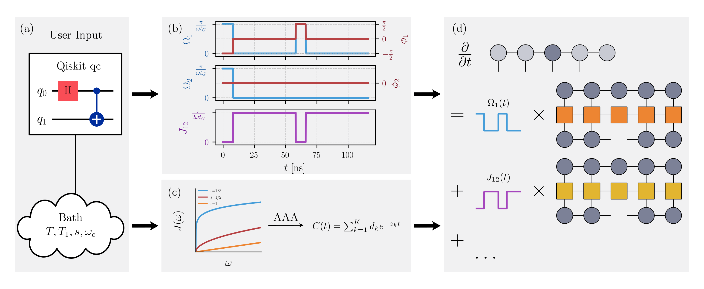
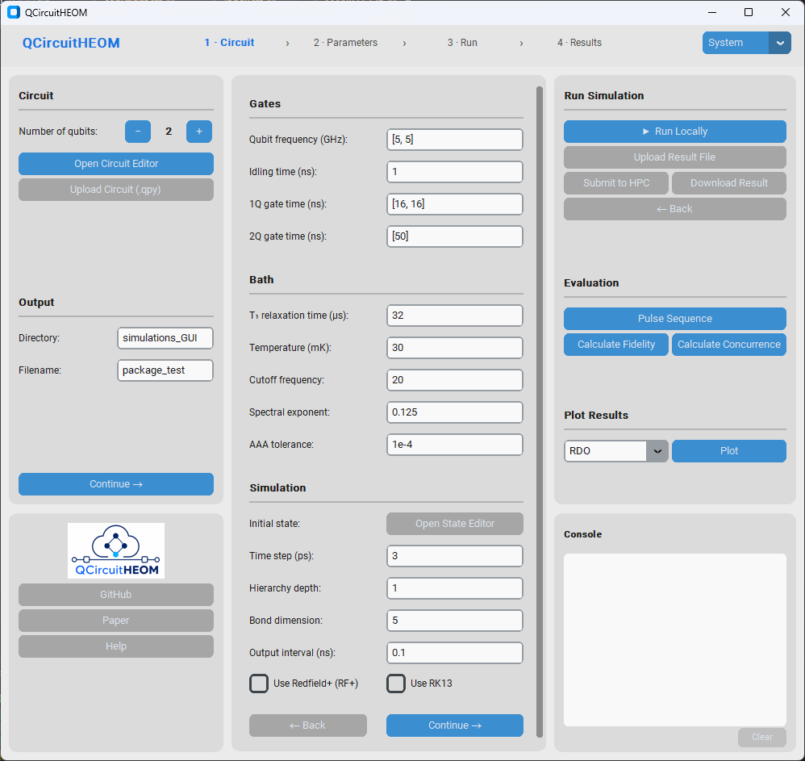

<p align="center">
    
</p>

<p align="center">
    <a href="https://qcircuitheom.readthedocs.io/en/latest/">
        </a>
    <a href="https://opensource.org/licenses/BSD-3-Clause">
        </a>
    <a href='https://github.com/dehe1011/QuantumDNA/actions/workflows/code-quality.yml'>
        </a>
    <!-- <a href='https://github.com/psf/black'>
        </a> -->
    <a href="https://pypi.org/project/qcheom/">
        </a>
    <a href="https://pypi.org/project/qcheom/">
        </a>
</p>

---

# QCircuitHEOM

**Authors: Kiyoto Nakamura, Dennis Herb**

QCircuitHEOM is a Python package for simulating quantum circuits in non-Markovian environments using free-pole hierarchical equations of motion (FP-HEOM) and tensor-train (TT) compression.

The package is designed for superconducting-qubit simulations and connects circuit-level Qiskit input with microscopic open-system dynamics.

<p align="center">
    
</p>

## Installation

Install QCircuitHEOM from PyPI with

```bash
pip install qcheom
```

## Basic usage

A typical workflow is:

1. Define a Qiskit quantum circuit.
2. Specify system, bath, and numerical parameters.
3. Run the QCircuitHEOM simulation.

```python
from qiskit import QuantumCircuit
from qcheom import calcTimeEvo

qc = QuantumCircuit(1)
qc.h(0)

# expected runtime: 1 min
calcTimeEvo(
   fileName="result",
   qc=qc,
   numQ=1,
   freqQ=[5.0],          # GHz
   rhoIni=[[1,0],[0,0]],
   gateTime=[0.16],      # ns
   idlingTime=0.01,       # ns
   T=30,                 # mK
   T1=32,                # µs
   omegaC=20,
   exp=1/8,
   tol=1e-6,
   dtFB=0.1,             # ps
   depth=[1],
   bondDim=5,
   strideTime=0.01,       # ns
)
```

1. Analyze the pulse sequence, reduced density matrix, and fidelity. For multiple qubits, also analyze concurrence and logarithmic negativity.

```python
import os
from qcheom import *

directory = os.getcwd()
fileName = 'result'

# load kwargs from QPY file 
kwargs = getKwargs(directory, fileName)

# load result from CSV file
t_list, rdo_list = getResult(directory, fileName)

# Post-processing
plotQC(**kwargs)
plotPulseSeq(**kwargs)
plotFidelity(t_list, rdo_list, **kwargs)
plotConcurrence(t_list, rdo_list, **kwargs)
plotLogNeg(t_list, rdo_list, **kwargs)
plotRDO(t_list, rdo_list, **kwargs)
```

## Graphical interface

QCircuitHEOM also provides a graphical user interface:

```python
from qcheom import GUI

GUI().mainloop()
```

<p align="center">
    
</p>

## Documentation

[](https://qcircuitheom.readthedocs.io/en/latest/)

The documentation is available on Read the Docs: https://qcircuitheom.readthedocs.io/en/latest/

## References

Recent papers from our group:

* K. Nakamura and J. Ankerhold, Entanglement dynamics and performance of two-qubit gates for superconducting qubits under non-Markovian effects. [*Physical Review Research* **8**, 013337 (2026).](https://doi.org/10.1103/b5jp-s6t2)
* K. Nakamura and J. Ankerhold, Impact of time-retarded noise on dynamical decoupling schemes for qubits. [*Physical Review B* **111**, 064503 (2025).](https://doi.org/10.1103/PhysRevB.111.064503)

## Acknowledgements
The implementation of tensor contraction routines was independently developed from scratch based on our understanding of the implementation in the `TT-Toolbox` project [Ivan (2026). oseledets/TT-Toolbox (https://github.com/oseledets/TT-Toolbox), GitHub. Retrieved September 6, 2026.]. 
The original source code is not included in this repository.

## License

QCircuitHEOM is distributed under the BSD 3-Clause License.

## Support

For questions or support, please contact Dennis Herb at dennis.herb@uni-ulm.de.

